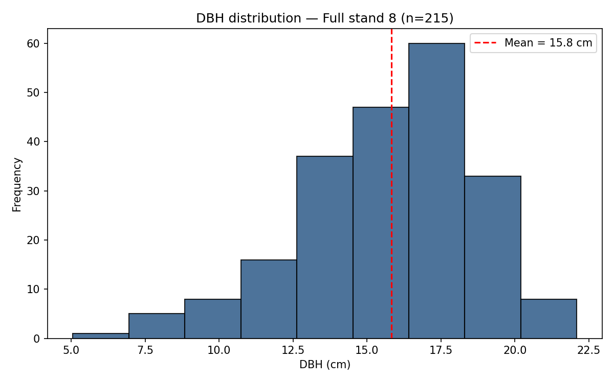
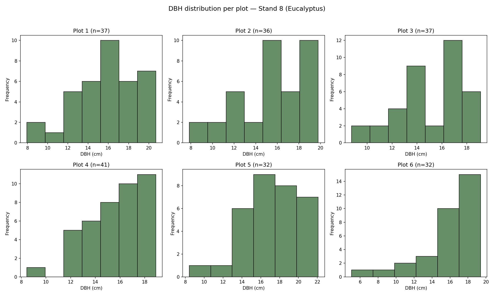

# Short Report — DBH Audit and Characterization (Stand 8, Eucalyptus)

## 1. Overall characterization

Stand 8 has **215 measured trees**, distributed across 6 sample plots (32 to 41
trees each), clonal eucalyptus (clone 1501), 7 years old, reform regime, 3×3 m
spacing.

| Plot | n | Mean DBH (cm) | Quadratic mean DBH (cm) | Std. dev. | Min | Max | CV (%) |
|---|---|---|---|---|---|---|---|
| 1 | 37 | 15.81 | 16.10 | 3.11 | 7.95 | 20.70 | 19.7 |
| 2 | 36 | 15.64 | 15.94 | 3.15 | 7.85 | 19.78 | 20.2 |
| 3 | 37 | 14.95 | 15.17 | 2.58 | 8.75 | 19.10 | 17.2 |
| 4 | 41 | 15.59 | 15.76 | 2.33 | 8.45 | 18.90 | 14.9 |
| 5 | 32 | 17.20 | 17.48 | 3.19 | 8.40 | 22.09 | 18.5 |
| 6 | 32 | 15.94 | 16.25 | 3.19 | 5.05 | 19.40 | 20.0 |
| **Stand** | **215** | **15.82** | **16.09** | **2.96** | **5.05** | **22.09** | **18.7** |

Plots are fairly homogeneous (means between 14.95 and 17.20 cm). **Plot 5** sits
slightly above the rest, and **Plot 4** shows the lowest variability (CV = 14.9%).
The stand-wide coefficient of variation (18.7%) is typical for an even-aged clonal
plantation.

## 2. Basal area

| Plot | Basal area (m²) | Basal area (m²/ha) |
|---|---|---|
| 1 | 0.753 | 17.08 |
| 2 | 0.719 | 16.30 |
| 3 | 0.669 | 15.16 |
| 4 | 0.800 | 18.13 |
| 5 | 0.768 | 17.42 |
| 6 | 0.664 | 15.05 |
| **Stand (average)** | **4.372** (total sampled) | **16.52** |

Basal area values between 15 and 18 m²/ha are consistent with a well-developed
7-year-old eucalyptus stand.

## 3. Planting density

Assuming each plot corresponds to a nominal 7×7 planting grid at 3×3 m spacing
(0.0441 ha per plot — see `README.md` for the full justification), observed density
ranges between **~725 and ~930 trees/ha** depending on the plot, always below the
nominal planting density of 1,111 trees/ha — reflecting normal gaps/mortality for
the stand's age.

## 4. Data quality

The per-plot IQR criterion flagged **4 trees** with low diameters (between 5.05 and
9.65 cm) as statistically atypical within their plots. None were treated as errors,
since all values fall within the biologically plausible range — they are more
likely **suppressed/dominated trees**, not typing errors (see `README.md` for the
full criterion and rationale).

## 5. Diametric distribution — histograms

**Full stand (n = 215):**

**Per plot:**

### Interpretation

The stand's distribution is **unimodal and slightly left-skewed**, with the highest
concentration of trees between 15 and 18 cm DBH and a longer tail toward smaller
diameters (5–10 cm). This pattern is typical of even-aged stands where competition
for light is already established: most trees track the stand's average growth,
while a small group of suppressed/dominated trees lags behind.

The pattern repeats consistently across plots (peaks between 15–18 cm in nearly
all), with the exception of **Plot 6**, which shows a more extreme lower tail
(minimum DBH of 5.05 cm, isolated from the rest of the distribution) — the tree
that stands out most in the quality audit (Section 4). There is no sign of
**bimodality** (which would indicate, for example, a mix of two ages or spacings
within the same plot), consistent with the stand being a uniform planting — same
clone, same age.

## 5b. Diameter class distribution (method: SD as class width, range for class count)

Following the assignment's instruction to use each group's own standard deviation
together with the range (amplitude) to build the diameter classes (rather than a
generic rule like Sturges'), class width was set equal to each group's standard
deviation, and the number of classes was obtained by dividing the range by that
width.

| Group | Std. dev. (class width, cm) | Range (cm) | Number of classes |
|---|---|---|---|
| Plot 1 | 3.11 | 12.75 | 5 |
| Plot 2 | 3.15 | 11.94 | 4 |
| Plot 3 | 2.58 | 10.35 | 5 |
| Plot 4 | 2.33 | 10.45 | 5 |
| Plot 5 | 3.19 | 13.70 | 5 |
| Plot 6 | 3.19 | 14.35 | 5 |
| **Stand (overall)** | **2.96** | **17.04** | **6** |

Full frequency tables (absolute and cumulative, in counts and %) for every plot and
for the whole stand are in `outputs/Q2_diameter_classes.xlsx` (one sheet per plot,
plus a "Stand_overall" sheet).

## 6. Estimate for the full stand (48.7 ha)

Expanding the density observed in the sample (215 trees in 0.2646 ha) to the full
stand area (48.7 ha):

- **Estimated total trees in the stand:** ≈ 39,600
- **Estimated trees with DBH ≥ 15 cm:** ≈ 25,950 (65.6% of the sample)

This extrapolation assumes the 6 sampled plots reasonably represent the variability
of the entire stand (see `README.md` for the limitations of this assumption).
